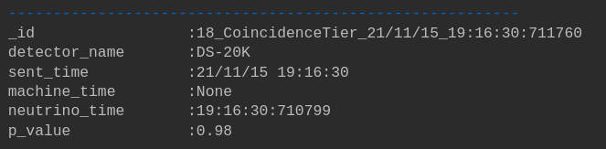

# SNEWS Publishing Tool

This packages provides users with a Python API and CLI to publish observation messages to SNEWS

    Note: CLI is still WIP 

## How to Install

    Note: Make sure your hop credentials are set up !!

First you need to clone this repo. In your terminal run the following:

````bash 
git clone https://github.com/SNEWS2/SNEWS_Publishing_Tools.git
````

Once cloned, install the package using pip (make sure you're in the cloned dir)

````bash
pip install .
````

## Message Schemas

    Note: Not the final schemas !!

### Coincidence Tier

````
_id                 
detector_name     (user input)    
sent_time           
machine_time      (user input)    
neutrino_time     (user input)     
p_value           (user input)    
````

### Significance Tier

````
_id                 
detector_name    (user input)      
sent_time           
machine_time     (user input)        
neutrino_time    (user input)       
p_value(s)       (user input)    
````

### Time Series Tier

````
_id                
detector_name   (user input)      
sent_time           
machine_time    (user input)      
neutrino_time   (user input)     
timing_series   (user input)
````

### False Obs

````
_id
detector_name           (user input)          
false_id                (user input, optional)    
which_tier              (user input)    
N_retract_latest        (user input)    
retraction_reason       (user input, optional)  
sent_time           
````

## How to Publish

Before we get started, right now the publishing method will send your message to the test kafka server.

First you need to import your desired Publisher class:

````Python
# Import the Publisher class
from SNEWS_PT.snews_pub import Publisher
# Import the constructor for Coincidence Tier
from SNEWS_PT.snews_pub import CoincidenceTier
# Import the constructor for Significance Tier
from SNEWS_PT.snews_pub import SignificanceTier
# Import the constructor for Timing Tier
from SNEWS_PT.snews_pub import TimingTier

````

Initialize the Publisher.

    Note: For this example I'm publishing to Coincidence Tier.

````Python
pub = Publisher()
````

Make your dummy nu time method (optional)

    Note: datetime object will be used to create a dummy nu times

```Python
from datetime import datetime


def nu_t():
    return datetime.utcnow().strftime("%H:%M:%S:%f")
```

Construct your message, don't forget the `.message()` at the end this returns the dict object with all your message
data. **Make sure you pass it a detector name**!

```Python
my_detector = 'DS-20K'
message = CoincidenceTier(detector_name=my_detector, nu_time=nu_t(), p_val = 0.98).message()
```


Now send it ! 
```Python
pub.send(message)
```

The output should look like this:


See `example.ipynb` for more tutorial scripts 