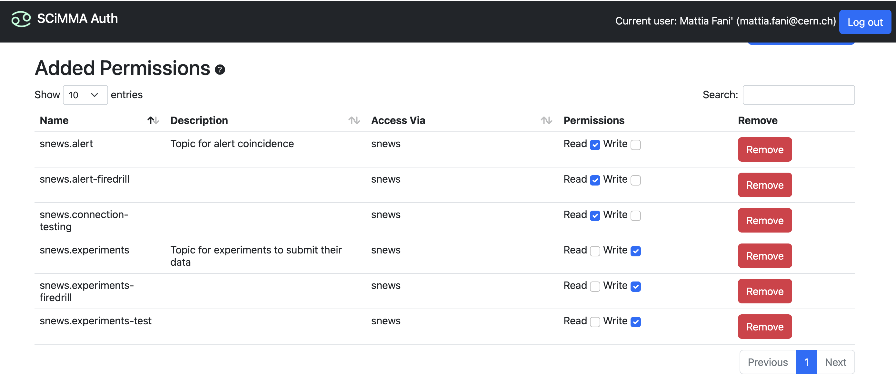

# Quickstart

Install the `snews_pt` package with its dependancies following the [installation guide](./installation.md).
The `snews_pt` package allows you to interact with the SNEWS server. As a user you can `subscribe` to receive alert messages 
issued by the server, `publish` the observation messages of your experiment, and send some `commands` to server to e.g. test your connection, request feedback regarding your previous heartbeats.

There are 2 main data streams that we use, as a SNEWS member, you have a *write-only* access to one of them so you can `publish` 
your observation messages triggered by your experiment, and you have a *read-only* access to the other so that you can `subscribe` and receive the alerts triggered by the server.

There is a third topic used for connection testing. Users also have *read-only* access to this topic. The connection testing is explained in the remote-commands section.

In order to have access to these topics, hop-client credentials are required.

## 1) Hop-Credentials
### 1.1) Setup hop-client 
`hop-client` is installed as a requirement for `snews_pt` test if you have it using your terminal.
```bash
hop --version
```
if this successfully returns you the version then you have the package. (_Notice `snews_pt` might require a specific version_)

If not install the hop-client via pip or conda
```bash
pip install -U hop-client
----------------------- OR
conda install -c conda-forge hop-client
```
You will need to request access to the SNEWS user group in SCIMMA Hopskotch via CILogon at https://my.hop.scimma.org/hopauth. 
For more information, see the [SCiMMA IAM docs](https://hop.scimma.org/IAM/Instructions/JoinInstitute) or the [Hopskotch Authenticator docs](https://github.com/scimma/scimma-admin/blob/master/doc/hopauth_guide.md#hopauth-for-users) for account management help.

Once you are on [hop's page](https://my.hop.scimma.org/hopauth) add credentials and store your username and password. On your local machine, you need to add this credentials to your `hop-client`.
Checkout `hop auth --help` on your terminal for instructions. You can add your username-password using `hop auth add`. Once it is done, your local computer knows about your credentials, and it can interact with the topics that credential has access to.

### 1.2) Request permissions
Once you have access to SNEWS user group, you can add permissions to the following topics;<br>
(These topics might change during the development)<br>
- snews.alert
- snews.alert-firedrill
- snews.experiments
- snews.experiments-firedrill
- snews.connection-testing


"alert" topics are to be subscribed and "experiments" to be published. Once you have access to these topics, they can be set in `snews_pt` once within the environment file to ease process.

## 2) Configurations

There are a few simple settings that can be modified depending on your needs like the `detector name` or the 
`output path` to store the incoming alert messages, or the topic names. These are stored in [auxiliary/test-config.env](https://github.com/SNEWS2/SNEWS_Publishing_Tools/blob/main/snews_pt/auxiliary/test-config.env) file. 

Once you install the `snews_pt` you can set your experiments name either by changing this file, or running the following command on a python API;
```python
import snews_pt
snews_pt.snews_pt_utils.set_name()
```
Here `set_name()` can take the name as a string, but if executed without an argument, it will display the accepted detector names and request an input based on the index of your detector.

Or you can also set your detectors name using the terminal;
```bash
snews_pt set-name
```

**You only need to this once**. As long as you do not set a valid name, `snews_pt` will keep complaining. Once the name is set, the `HAS_NAME_CHANGED` argument will be changed to 1 to indicate the program not to ask again.

Similarly, if you wish to use a different topic as the "alert topic" or "observation topic" instead of the default ones. You can change these entries in the environment file.

> Once you set these, you are ready to publish your observations and subscribe to alerts!

## 3) Interact with the Server
### 3.1) Test your connection
`snews_pt` has a tool to test your connection, if the topic that you are trying to test is running on the server it should see 
your test message and send back a confirmation to you. Simply run the following on your terminal,

```bash
snews_pt test-coincidence --no-firedrill
```
Sometimes the "firedrill" broker is running, if that is the case you can omit `--no-firedrill` flag.


### 3.2) Subscribe and Publish
Here is a quick start for subscribing to alert messages and sending 
your observation messages using the command line interface. For Python API and more see the table of contents below.

```bash
snews_pt subscribe
```

```bash
snews_pt publish my_json_message.json
```

## 4) Further Use  

You can find further documentation regarding the use of `snews_pt` in index. 
We provide both a python API and a
command line access to most of `snews_pt` functionalities. 

[//]: # (**Table of Contents**)

[//]: # (1. [Python API]&#40;#python-api&#41;)

[//]: # (    1. [Publish]&#40;#how-to-publish&#41;)

[//]: # (    2. [Subscribe]&#40;#how-to-subscribe&#41;)

[//]: # (    )
[//]: # (    )
[//]: # (2. [Command Line Interface-&#40;CLI&#41;]&#40;#command-line-interface-&#40;cli&#41;&#41;)

[//]: # (    1. [Subscribe]&#40;#subscribing-to-alert-topics&#41;)

[//]: # (    2. [Message Schema]&#40;#message-schema&#41;)

[//]: # (    3. [Publish]&#40;#publishing-observation-messages&#41;)

[//]: # (    4. [Publish Heartbeat]&#40;#publishing-heartbeat-messages&#41;)

[//]: # (    7. [Retraction]&#40;#retraction-ressages&#41;)

[//]: # ()
