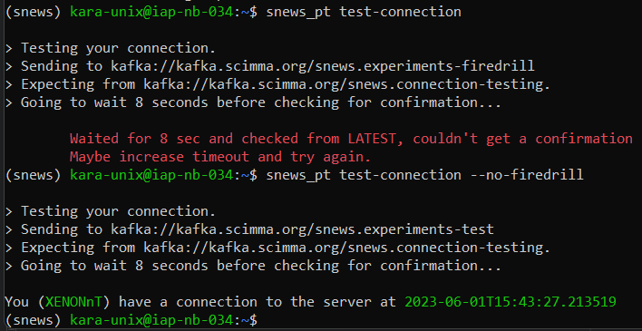

# Quickstart

Install the `snews_pt` package with its dependancies following the [installation guide](./installation.md).
The `snews_pt` package allows you to interact with the SNEWS2.0 server. <br> 

User can subscribe to the alert messages and publish their observation messages to the server. <br>
This is done using the scimma's hopskotch client. For more on hopskotch and the available topics, see [here](./hopskotch.md).

First you need to generate credentials and join the snews group. 

## 1) Hop-Credentials

Go to [https://my.hop.scimma.org/hopauth](https://my.hop.scimma.org/hopauth) and generate account and request access to the SNEWS user group. 
See [this page](https://github.com/scimma/hop-client/wiki/Tutorial:-using-hop-client-with-the-SCiMMA-Hopskotch-server) for help.

### 1.1) Setup hop-client 
`hop-client` should already be installed as a requirement for `snews_pt` confirm your installation by checking the version
```bash
hop --version
```
if this successfully returns you the version then you have the package. (_Notice `snews_pt` might require a specific version_)

If not install the hop-client via pip or conda
```bash
pip install -U hop-client
----------------------- OR
conda install -c conda-forge hop-client
```

Once you are on [hopauth page](https://my.hop.scimma.org/hopauth) login with to your account and add credentials (the plus icon on the top left) and store your username and password.<br> 

On your local machine, you need to add this credentials to your `hop-client`.
Checkout `hop auth --help` on your terminal for instructions. You can add your username-password using `hop auth add`. Once it is done, your local computer knows about your credentials, and it can interact with the topics that credential has access to.

### 1.2) Request permissions
You now have a hop account and newly created credentials, however, you still do not have access to SNEWS topics. For that, you are first required to be added to the 
SNEWS User group by one of the admins. For that please contact us on SNEWS slack, on the implementation channel. 
Different groups and the topics are detailed in [hopskotch page](./hopskotch.md)<br>

Once you have access to certain SNEWS user group, you can add permissions to the following topics;<br>
(These topics might change during the development)<br>
- snews.alert
- snews.alert-firedrill
- snews.experiments
- snews.experiments-firedrill
- snews.connection-testing


"alert" topics are to be subscribed and "experiments" topics are to be published. `snews_pt` uses these topics to interact with the server. <br>
The `snews_pt` package includes the default observation and alert topics for both firedrill and non-firedrill cases. However, different topics can also be specified. See the next section.

## 2) Configurations
 
The package comes with a default configuration file that contains some useful information. 
This file can be found under [auxiliary/test-config.env](https://github.com/SNEWS2/SNEWS_Publishing_Tools/blob/main/snews_pt/auxiliary/test-config.env) and looks like this;
```python
DETECTOR_NAME='TEST'
HAS_NAME_CHANGED='0'
...
HOP_BROKER="kafka.scimma.org"

OBSERVATION_TOPIC="kafka://${HOP_BROKER}/snews.experiments-test"
ALERT_TOPIC="kafka://${HOP_BROKER}/snews.alert-test"
PRODUCTION_TOPIC=""

FIREDRILL_OBSERVATION_TOPIC="kafka://${HOP_BROKER}/snews.experiments-firedrill"
FIREDRILL_ALERT_TOPIC="kafka://${HOP_BROKER}/snews.alert-firedrill"
CONNECTION_TEST_TOPIC="kafka://${HOP_BROKER}/snews.connection-testing"
```
The file can fetch the topics and can also be aware of the detector's name thus reducing the manual tasks. 
As long as you have "TEST" as your detector name, software will raise a warning and remind you to change it. <br>

Once you install the `snews_pt` you can set your experiments name either by changing this file, or running the following command on a python API;
```python
import snews_pt
snews_pt.snews_pt_utils.set_name()
```
Here `set_name()` can take the name as a string, but if executed without an argument, it will display the accepted detector names and request an input based on the index of your detector.

Or you can also set your detectors name using the terminal;
```bash
snews_pt set-name
```

**You only need to this once**. As long as you do not set a valid name, `snews_pt` will keep complaining. Once the name is set, the `HAS_NAME_CHANGED` argument will be changed to 1 to indicate the program not to ask again.

> Warning: If you run tests, each time you use a different detector name, this file will change. Be aware that unless the detector name is not passed explicitly it will fetch it from this file.


Similarly, if you wish to use a different topic as the "alert topic" or "observation topic" instead of the default ones. You can change these entries in the environment file.

 Once you set these, you are ready to publish your observations and subscribe to alerts!

## 3) Interact with the Server
### 3.1) Test your connection
`snews_pt` has a tool to test your connection, if the topic that you are trying to test is running on the server it should see 
your test message and send back a confirmation to you. Simply run the following on your terminal,

```bash
snews_pt test-connection --no-firedrill
```
Sometimes the "firedrill" broker is running, if that is the case you can omit `--no-firedrill` flag.



### 3.2) Subscribe and Publish
Here is a quick start for subscribing to alert messages and sending 
your observation messages using the command line interface. For Python API and more see the table of contents below.

```bash
snews_pt subscribe
```

```bash
snews_pt publish my_json_message.json
```

For more information, see the respective pages for [publish](./publishing_protocols.md) and [subscribe](./subscribing_protocols.md).

## 4) Further Use  

You can find further documentation regarding the use of `snews_pt` in index. 
We provide both a python API and a
command line access to most of `snews_pt` functionalities. 

[//]: # (**Table of Contents**)

[//]: # (1. [Python API]&#40;#python-api&#41;)

[//]: # (    1. [Publish]&#40;#how-to-publish&#41;)

[//]: # (    2. [Subscribe]&#40;#how-to-subscribe&#41;)

[//]: # (    )
[//]: # (    )
[//]: # (2. [Command Line Interface-&#40;CLI&#41;]&#40;#command-line-interface-&#40;cli&#41;&#41;)

[//]: # (    1. [Subscribe]&#40;#subscribing-to-alert-topics&#41;)

[//]: # (    2. [Message Schema]&#40;#message-schema&#41;)

[//]: # (    3. [Publish]&#40;#publishing-observation-messages&#41;)

[//]: # (    4. [Publish Heartbeat]&#40;#publishing-heartbeat-messages&#41;)

[//]: # (    7. [Retraction]&#40;#retraction-ressages&#41;)

[//]: # ()
